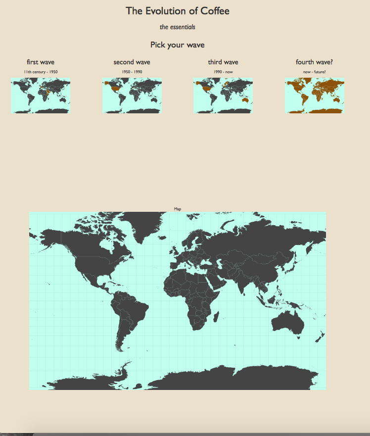

# The Design Document

As a basis for my design, I will use bootstrap for creating rows and dividing those rows in colums. This will be writtin in my main HTML-file.

Apart for my HTML-file, I will use 5 other files of coding:
- Firstly, my own Javascript file. This piece of code will consist mainl of a single function, InitVis(). In this function, I will first create a bunch of variables and constant, needed for the creation of the maps. After that, I will load world-50m.json using d3 and TopoJSON, and create several maps. Using d3, I will also use the mouseover and mouseclick event listeners to create the interactivity. Lastly, I will create the tooltips, showing information on the specific country. 
The idea is that the user will have to choose one of four 'waves'. These will be represented by small maps with text. In these maps, the relevant countries for that wave have already been highlighted. When one of those maps is clicked, the bigger map on the bottom will become the same as the smaller map, and the countries that were highlighted will also here be highlighted. But when moving over those countries, they will light up (by change the colour of that countries and creating a very thick border of the same colour), and one or more tooltips will pop up. 
At this moment, my idea is to already create all the general info texts, and only make them visible when the relevant wave has been selected. I will all put them in a <\p> element, hereby saving me all the trouble of selecting the right coordinates and stuff like that. I will do this with one outer div element, with 4 smaller div elements. The text elements for the tooltip will be put in an array, and only one tooltip will be created. This tooltip will change location upon a specific mouseover, and the content will change as well. 

All together, when clicking from wave to wave, this visualisation should tell the story of the evolution of coffee, in all his glory. I will also add references to several sources I have used, thereby giving credit where credit due. 
- The d3 Javascript file.
- The TopoJSON Javascript file.
- The CSS file for my HTML. Here I will make some general styling decisions, such as the default font and background colour. All very basic.
- The CSS file for my SVG. This will be used to give all the different element sof the maps and the tooltips their own styling. 

### Data sources:

#### Books

- The World Atlas of Coffee (@Coffeecompany Branderij)
- Puur Koffie (@Coffeecompany Branderij)
- ...

#### People

- Rick Woertman (owner Espressofabriek, first coffeebar in Amsterdam to have its own roaster), http://www.espressofabriek.nl/
- Lex Wenneker (owner Espressobus, co-owner Headfirst Coffee Roasters, Barista Champion Netherlands 2015), http://headfirstcoffeeroasters.com/
- Sebastiaan Gerstdorfer (barista and roaster @Espressofabriek, previously @Coffeecompany Branderij), https://www.coffeecompany.nl/locations/zeeburgerpad-1/
- Felix Petersma (= me) (barista @ Espressofabriek, previously @Coffeecompany)
- Mitchell Calmao Baptista (barista and co-owner @Daltons coffee & barista @Espressofabriek, previously @Ristretto London)
- ...

##### Websites

- 'Seattle Coffee Guide: The Evolution of Coffee', http://www.seattlemag.com/article/seattle-coffee-guide-evolution-coffee
- 'The Evolution of the Coffee House', http://coffeetea.about.com/od/history1/a/shophistory.htm
- 'The Story of Kaldi', http://en.wikipedia.org/wiki/Kaldi
- 'The History of Coffee', http://www.ncausa.org/i4a/pages/index.cfm?pageID=68
- 'History of Coffee', http://en.wikipedia.org/wiki/History_of_coffee
- 'Espresso', http://en.wikipedia.org/wiki/Espresso
- 'Specialty Coffee', http://en.wikipedia.org/wiki/Specialty_coffee
- 'SCAA', http://en.wikipedia.org/wiki/Specialty_Coffee_Association_of_America
- 'Blue Bottle Coffee', https://bluebottlecoffee.com/
- 'Intelligentsia Coffee', http://www.intelligentsiacoffee.com/
- 'CoffeaArabica 02' by Elcambur - Own work, Licensed under CC BY 3.0 via Wikimedia Commons, http://commons.wikimedia.org/wiki/File:CoffeaArabica_02.jpg#/media/File:CoffeaArabica_02.jpg
- 'Japan's coffee culture', http://www.japantoday.com/category/opinions/view/japans-coffee-culture
- ...

### User Interface
