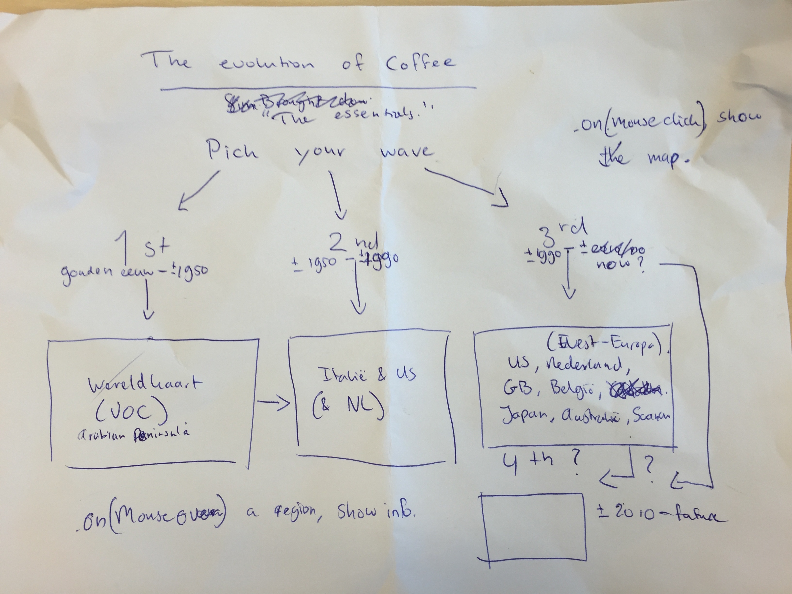

# EvolutionOfCoffee

*How did coffee become the product as we know it today?*

Not sure yet if focus should be mainly on Arabica, or only. 

Visualisation for Programmeerproject

## Proposal

### General

My plan is to visualise the evolution of the product coffee, from the myth about Kaldi the Ethiopian goatherd to Howard Schuldz introducing espresso at Starbucks in 1982, and from a single coffee market, introduced by the Dutch East Indian Company (VOC), to direct trade between roasteries and farms, together trying to optimize the flavour of a single origin coffee. This evolution can be divided in three waves, possibly fourth (in which the case the fourth wave has just started).I will be using maps to show which countries were significantly involved in every wave, and per country some important information will be available: influential companies and people that were involved, some statistics on that country around that time (e.g. total coffee export per year). Also possible some fun facts per country or wave, and the common methods that were used at that time. So I think I will also write a short story about every wave, explaining the main characteristics and differences compared to the previous wave. For the first wave, this storty will possibly be about Kaldi and his dancing goats.

### Interactivity

When starting the visualisation, the user will first see a black screen with the title "The Evolution of Coffee" and the subscript "From Kaldi to homeroasting". Below this will be the text, all centered, "Pick your wave". Below this, the user will have to possibility to click on one of the three/four waves. When they do so, a map will be appear on the screen. This will be below the rest of the visualisation, or will be a sort of pop-up screen, I'm not sure yet. 

When moving the mouse over the a specific country, this company will highlight/pop-up and information will become available. 

### Information (so far)

#### First wave (11th century - +/- 1950)

**The Story of Kaldi** Long, long ago, in the far-away Ethiopian highlands, there lived a goatherd. His name was Kaldi, and one day he noticed his dancing and being unable to sleep at night after eating the berries from a certain plant. Kaldi told the abbot at the local monastery about his findings, and the abbot and the other monks started exploring this unique berry and its effects. Although this story is just a myth and can not be confirmed, coffee does originate from Ethiopia. 

*when moving over the Arab Peninsula* After its discovery in Ethiopia, the Arabs were the first to cultivate and trade coffee. This was around 14th century, and for next couple of hundred years, the Arabs held a monopoly on coffeetrade. In the 15th century it was mainly grown in the Yemeni district of Arabia, but by the 16th century coffee was being drunk in Persia, Turkey, Egypt and Syria. This also led to the creation of the first coffee houses, of which the first one was reported to be located at Constantinopel in 1475, and was called 'Kiva Han'.

*when moving over the Netherlands* Because the Arabs only sold roasted beans, the Netherlands, among other European countries, were not able to cultivate coffee themselves. This monopoly came to an end when a trader from the Dutch East Indian Company, Pieter van der Broecke, managed to 'obtain' (some sources say 'steal') some coffee plants from Yemen in 1616. These plants grew so well in the Amsterdam Botanical Gardens, that in 1658 the first 'Coffea Arabica' was being cultivated in Ceylon(Sri Lanka) and not much later also in other Dutch colonies, such as India, Java (Indonesia) and Suriname. 

*when moving over France* Although the Dutch were the first to cultivate coffee outside of the Arabian Peninsula, the French were the ones who exported it to biggest coffee-producing country in the world, Brazil. Back in 1714, the Mayor of Amsterdam gave King Louise XIV of France a coffee plant, as a present to grow in the Paris Royal Botanical Gardens. Some of the seeds of this plant were taken by Gabriel de Clieu in 1723 and brought to Martinique, one of the French colonies at that time. Most of the coffee that is being grown in Middle and Southern America today originates from those seeds. 

*statistics*

#### Second coffee wave (1950 - 1980)

**The Start of the Second wave** After the discovery of the coffee in Ethiopia and it being cultived all over the world, coffee was almost indispensable in the daily routine of many people around the world. The coffee houses were places were people met to talk about all sorts of things, from day-to-day stuff to important strategic decisions. And although there were differences, almost all coffee made using a filtering technique; the roasted beans were grinded and the coffee was extracted using hot water. Espresso started growing in popularity around the world from around 1950, thereby ushering the second wave of coffee. 

*when moving over Italy* An espresso was made with a different technique. A small amount of water was pushed through coffeegrounds. This technique was first patented by Angelo Moriono in Turin in 1884, and the espresso machine has been perfected ever after. Espresso was a very popular drink, not just because the drink itself, but also because the variations that came with it, such as the cappuccino, which is an espresso with foamed milk. This version was particulary popular outside of Italy itself, mainly in Gread Britain. In Italy, espresso was a beverage for the working-class, and the price of a single espresso, if you were standing at the bar while drinking it, was being regulated by the government, and thus keeping it very, very affordable.

*when moving over the US* Although espresso was already known in the United States, it wasn't a well known drink until the 1990's. Before, coffee had been the most popular drink in the United States since 1820, but nobody had given much care to the production of it. As long as it had a lot of caffeine in it and kept you awake, it did not really matter how it tasted. There even was instant-coffee (not just in the United States, most coffee drinker around the world did not care much for flavour, as long as it kept you going.) This when Howard Schultz moved to Starbucks in 1982. Howard Schultz, inspired by the Italian espresso culture, introduced espresso and lots of different espresso-based drinks. The success this has brought Starbucks has been immense, quickly conquering the US and most of Western Europe. Starbucks also introduced something important; they were the first who started direct-trading with the farmers at a global scale. Instead of buying their coffee on world market for coffee, they started paying more for a certain variation of coffee, grown at a specific farm in a specific region of a specific country, and working together with the farmers to create, in their eyes, a perfect coffeebean. 

#### Third coffee wave 

*statistics* coffee trade, brands (la marzocco, synesso, starbucks, peet's coffee). 

### Sources

#### Books

- The World Atlas of Coffee (@Coffeecompany Branderij)
- Puur Koffie (@Coffeecompany Branderij)
- ...

#### People

- Rick Woertman (owner Espressofabriek, first coffeebar in Amsterdam to have its own roaster), http://www.espressofabriek.nl/
- Lex Wenneker (owner Espressobus, co-owner Headfirst Coffee Roasters, Barista Champion Netherlands 2015), http://headfirstcoffeeroasters.com/
- Sebastiaan Gerstdorfer (barista and roaster @Espressofabriek, previously @Coffeecompany Branderij), https://www.coffeecompany.nl/locations/zeeburgerpad-1/
- Felix Petersma (= me) (barista @ Espressofabriek, previously @Coffeecompany)
- Mitchell Calmao Baptista (barista and co-owner @Daltons coffee & barista @Espressofabriek, previously @Ristretto London)
- ...

##### Websites

- 'Seattle Coffee Guide: The Evolution of Coffee', http://www.seattlemag.com/article/seattle-coffee-guide-evolution-coffee
- 'The Evolution of the Coffee House', http://coffeetea.about.com/od/history1/a/shophistory.htm
- 'The Story of Kaldi', http://en.wikipedia.org/wiki/Kaldi
- 'The History of Coffee', http://www.ncausa.org/i4a/pages/index.cfm?pageID=68
- 'History of Coffee', http://en.wikipedia.org/wiki/History_of_coffee
- 'Espresso', http://en.wikipedia.org/wiki/Espresso
- ...

## Sketches

