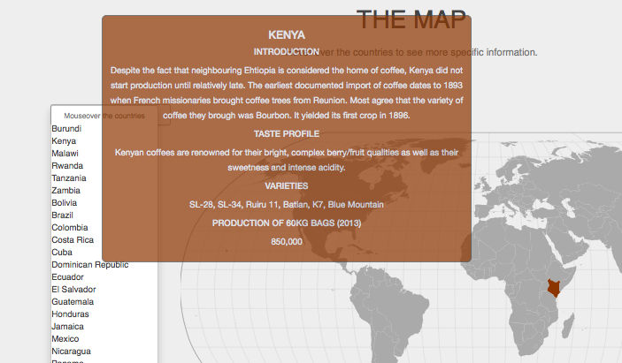

# EvolutionOfCoffee

## Screenshots

## Purpose

This project visualiseses the evolution of the product 'coffee', from when it was first discovered to the product it is today. It aims to give better insight into the origin and story of one of the most enjoyed beverages in the world.

## License

MIT-license

## Creator

Felix Thomas Petersma

Copyright (C) *2015 Felix Thomas Petersma*

## Sources

### External code

*It is import to note that external code might have been published under a different license.*

- Mike Bostock (http://bost.ocks.org/mike/, http://bl.ocks.org/mbostock/1087001, http://bost.ocks.org/mike/map/, )
- D3 (http://d3js.org/)
- jQuery (https://jquery.com/)
- Bootstrap (http://getbootstrap.com/)
- 'Agency'-template (http://startbootstrap.com/template-overviews/agency/)

### External images
- Background image (http://pabloandrustys.com.au/images/uploads/PR-sustainability-feature.jpg)